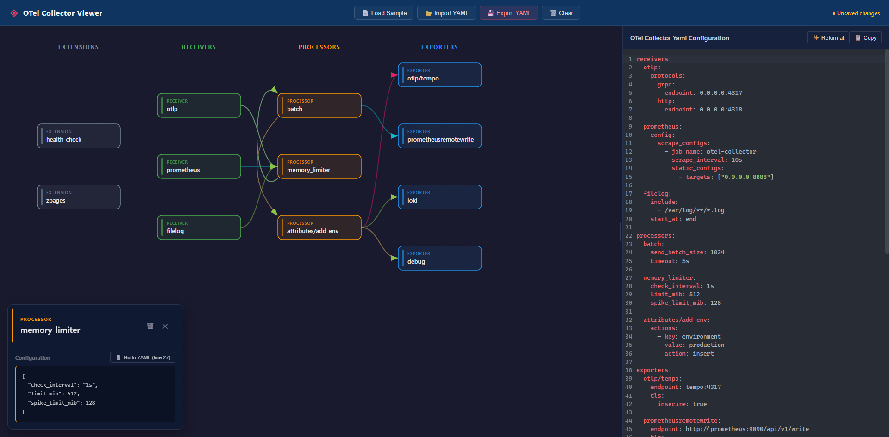

# OTel Collector Viewer

A visual, interactive editor for OpenTelemetry Collector configuration files. 

Parse, validate, visualize, and edit your OTel Collector pipelines as node-based graphs — then export back to valid YAML.




## Features

- **YAML ↔ Visual round-trip**: Import an OTel Collector config and see it as an interactive graph. Edit the YAML and watch the graph update in real time.
- **Layered pipeline visualization**: Receivers, processors, exporters, extensions, and connectors rendered as a left-to-right DAG using d3.js, with color-coded nodes and signal-colored edges.
- **Drag-and-drop nodes**: Rearrange nodes freely — edges follow in real time.
- **Click-to-inspect**: Click any node to see its full configuration and jump directly to its definition in the YAML editor.
- **Delete components**: Remove nodes from the graph — automatically cleans all pipeline references.
- **Syntax-highlighted YAML editor**: CodeMirror 6 with oneDark theme, line numbers, Tab/Shift+Tab indentation, and undo/redo.
- **Validation & auto-repair**: Detects dangling references, unused components, and empty pipelines. Auto-removes invalid pipeline references. Clickable error links jump to the problem line.
- **Reformat YAML**: One-click reformatting that preserves comments.
- **Import/Export**: Load YAML files, export edited configs, copy to clipboard.
- **Resizable panels**: Drag the divider between graph and editor to customize your layout.
- **Sample configs**: Load example configurations to explore the tool instantly.

## Demo

> 🚧 Coming soon — hosted on [GitHub Pages](https://AlainGhawi.github.io/otel-collector-viewer/)

## Getting Started

### Prerequisites

- Node.js >= 20
- Angular CLI >= 21

### Installation
```bash
git clone https://github.com/AlainGhawi/otel-collector-viewer.git
cd otel-collector-viewer
npm install
```

### Development
```bash
ng serve
```

Navigate to `http://localhost:4200/`. The app reloads automatically on source changes.

### Build
```bash
ng build
```

Build artifacts are stored in the `dist/` directory.

### Tests
```bash
ng test          # Unit tests
ng lint          # Linting
```

## Architecture
```
src/
├── app/
│   ├── core/
│   │   ├── models/          # OTel config data models, validation & error types
│   │   └── services/        # YAML parser, serializer, validator, state management
│   ├── features/
│   │   ├── graph-viewer/    # d3.js layered DAG visualization
│   │   ├── node-detail/     # Click-to-inspect component detail panel
│   │   ├── yaml-panel/      # CodeMirror 6 YAML editor with syntax highlighting
│   │   └── toolbar/         # Import/export/actions toolbar
│   └── shared/              # Reusable components & utilities
public/
    └── sample-configs/      # Example OTel Collector YAML files
```

### Data Flow
```
YAML File → ConfigParserService → OtelConfig Model → GraphViewerComponent (d3.js)
                                       ↕                        ↕
                              ConfigValidatorService    Click/Delete actions
                                       ↕                        ↕
                            ConfigSerializerService ← ConfigStateService (signals)
                                       ↓
                                  YAML Output → CodeMirror Editor
```

## Tech Stack

| Layer            | Technology                |
|:-----------------|:--------------------------|
| Framework        | Angular 21 (zoneless)     |
| Visualization    | d3.js                     |
| Code Editor      | CodeMirror 6              |
| YAML Parsing     | js-yaml                   |
| YAML Formatting  | yaml (comment-preserving) |
| State Management | Angular Signals           |
| Styling          | SCSS                      |
| CI/CD            | GitHub Actions            |
| Hosting          | GitHub Pages              |

## Contributing

Contributions are welcome! Please read our [Contributing Guide](CONTRIBUTING.md) and [Code of Conduct](CODE_OF_CONDUCT.md) before submitting a PR.

## Roadmap

- [x] Core YAML parser for OTel Collector configs
- [x] d3.js layered pipeline graph rendering
- [x] Drag-and-drop node repositioning
- [x] Live YAML ↔ graph sync
- [x] Click-to-inspect node details with YAML line linking
- [x] Config validation with auto-repair and clickable error links
- [x] Syntax-highlighted YAML editor (CodeMirror 6)
- [x] YAML reformatting with comment preservation
- [x] Delete components (graph + pipeline cleanup)
- [x] Export to clipboard / download
- [x] Extensions and connectors visualization
- [x] Resizable editor panel
- [ ] Add new components from a palette/menu
- [ ] Connect/disconnect pipeline edges visually
- [ ] Right-click context menu on nodes and edges
- [ ] Component library (known receivers, processors, exporters)
- [ ] Pipeline filtering by signal type
- [ ] Dark/light theme toggle
- [ ] Shareable config links (URL-encoded)

## License

This project is licensed under the MIT License — see the [LICENSE](LICENSE) file for details.

## Acknowledgments

- [OpenTelemetry](https://opentelemetry.io/) for the incredible observability ecosystem
- [d3.js](https://d3js.org/) for powerful data-driven visualizations
- [CodeMirror](https://codemirror.net/) for the excellent code editor